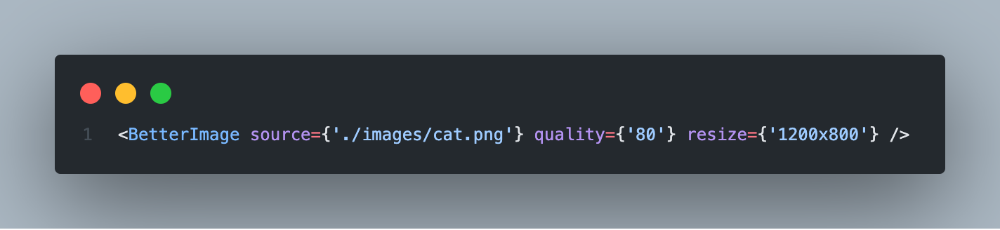

# BetterImage Documentation

## What Is BetterImage

BetterImage enhances the image rendering experience on React by providing a component that compresses and edits images.



## Installation 
There are several ways to get started with BetterImage component. If you are having hard time getting started using the "Master" branch method, we've created an "Easy-Setup" branch for users to quickly get started using pre-configured folder. <br>
Precaution: "Easy-Setup" branch will be a lot heavier in size versus the Master branch from included node_modules folder. 

### 1) Master Branch (manual Webpack config for create-react-app)

Step 1: Clone the repository to your local folder using `git clone https://github.com/oslabs-beta/BetterImage.JS` <br>
Step 2: Navigate to `cd betterimage.js` into the folder <br>
Step 3: Run `npm install` to download the node_module dependencies <br> 
Step 4: Navigate to WebPack config file via `cd node_modules/react-scripts/config` <br>
Step 5: Open the WebPack file using `open webpack.config.js` <br>
Step 6: `Cmd+f` or navigate to line 581 to locate "file-loader"  <br>
Step 7: Add a new line of code `esModule: false` in between line 588 and 589 inside the "options" object <br>
Step 8: Save the "webpack.config.js" file <br>
Step 9: Run the application in development setting using `npm start` <br>

### 2) Easy-Setup Branch (pre-configured node_modules)

Step 1: Clone the branch to your local folder using `git clone --single-branch --branch easy-setup https://github.com/oslabs-beta/BetterImage.JS` <br>
Step 2: Navigate into the folder using `cd betterimage.js`
Step 3: Run the application in development mode using `npm start`

### 3 NPM Install (add to existing project)

This feature is work in progress

## Starting with BetterImage

### Basic Structure


```
import BetterImage from "./src/components/BetterImage/BetterImage.js"

<App>
	<BetterImage source=”./img1.png” />
	<BetterImage source=”./img2.png” grayscale="100" />
	<BetterImage source=”./img3.png” rotation="180" />
</App>

```

### 2.2 Features
Image compression, resize, 
Works with both Class and Hooks
SEO optimization


## 3 Advanced Guides

### 3.1 Default Parameters
When BetterImage component doesn't receive optional parameters, it defaults to constant parameters specified in the code. The deafult parameters are as following:


BetterImage component uses `ImportAll` syntax to import all converted images to the rendering webpage. This step requires file-loader to disable the `esModule` by setting it to `false`. 


### 3.2 Why is Installation so Difficult?
BetterImage leverages ES6 syntax `importAll` to  dynamically reference the converted images. For BetterImage to leverage this feature, WebPack in the node_modules folder configuration must be modified.

## 4 Results


## 5 Reference

### 6.1 Related Resources

## 7 FAQ


### `npm run build`

[BetterImage](https://www.betterimagejs.com) 


