# BetterImage Documentation

## What Is BetterImage

BetterImage enhances the image rendering experience on React by providing a component that compresses and edits images.


## Installation 
### There are several ways to install BetterImage:
1) "Master" branch method provides the component withtout the node_modules configuration. This version requires several manual steps to configure.
```
https://github.com/oslabs-beta/BetterImage.JS
```
2) "Easy-Setup" branch is available to quickly get started using pre-configured node_modules. <br>
```
https://github.com/oslabs-beta/BetterImage.JS/tree/easy-setup
```
<em> Note: "Easy-Setup" branch will be much larger in size versus the Master branch from the included node_modules folder </em>

### Master Branch Setup (manual Webpack config using create-react-app)

1) Clone the repository to your local folder using `git clone https://github.com/oslabs-beta/BetterImage.JS` <br>
2) Navigate to `cd betterimage.js` into the folder <br>
3) Run `npm install` to download the node_module dependencies <br> 
4) Navigate to WebPack config file via `cd node_modules/react-scripts/config` <br>
5) Open the WebPack file using `open webpack.config.js` <br>
6) `Cmd+f` or navigate to line 581 to locate "file-loader"  <br>
7) Add a new line of code `esModule: false` in between line 588 and 589 inside the "options" object <br>
8) Save the "webpack.config.js" file <br>
9) Run the application in development mode using `npm start` <br>

### Easy-Setup Branch (pre-configured node_modules)

1) Clone the branch to your local folder using `git clone --single-branch --branch easy-setup https://github.com/oslabs-beta/BetterImage.JS` <br>
2) Navigate into the folder using `cd betterimage.js` <br>
3) Run the application in development mode using `npm start`

### NPM Install (add to existing project)

1) This feature is work in progress

## Getting Started
In the cloned repository, `src/components/App` holds the `App.js` file which contains several examples of the BetterImage component <br>

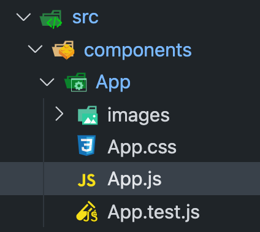 <br>

Inside the App.js, BetterImage.JS is imported. Unlike vanilla React application, you do not need to use `import from` to render images (more on this on dynamic image references under feature)

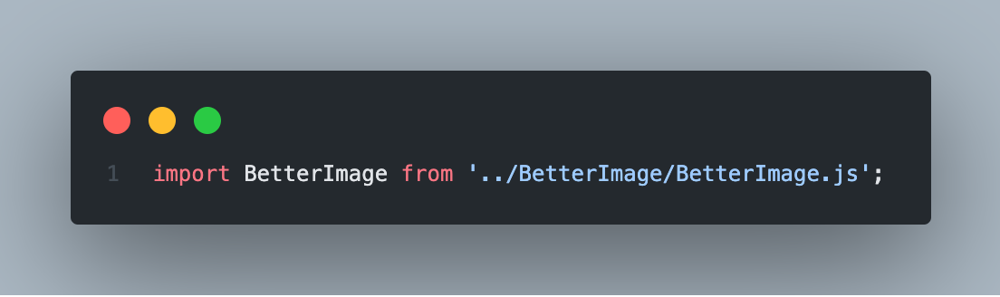

Notice that instead of using the `` tag, `<BetterImage/>` tag is used instead. Notice for BetterImage, "source" attribute is passed instead of the "src" attribute. <br>

<br>
It is important to note "source" is the only required attribute for BetterImage components. Additional attributes can be chained separated by a space. Full list of attributes can be found below in the "Features" section.<br>
```
<BetterImage source=”./images/avocado.png” /> // required source attribute
<BetterImage source=”./images/cat.png” grayscale="100" /> // chained atributes
<BetterImage source=”./images/colors.png” graysclae="100" rotation="180" />
```
We recommend getting familiarized with our App.js example before implementing your own BetterImage component. Note that App.js example is written as Class-based component but BetterImage can also be used in Hooks (due to absence of state management). 

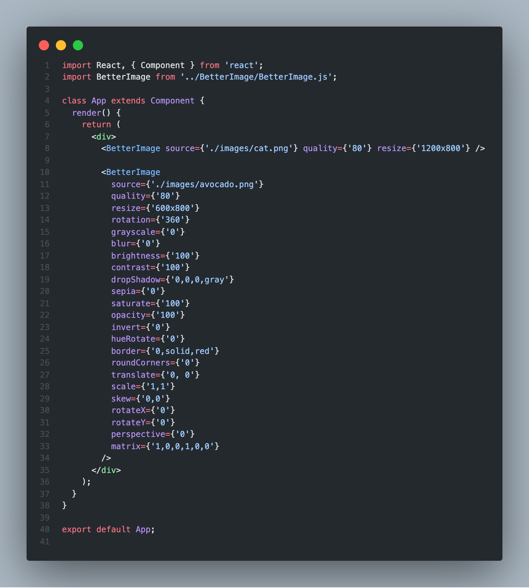

## Main Features
Two main features are mandated with BetterImage:
1) File type conversion
2) File compression

### File Type Conversion
File type conversion is fixed to webp in version 1.0.0. Meaning, every image rendered using BetterImage will have a file type of webp when displayed on the React application. The webp conversion feature is powered by Google's cwebp engine. 

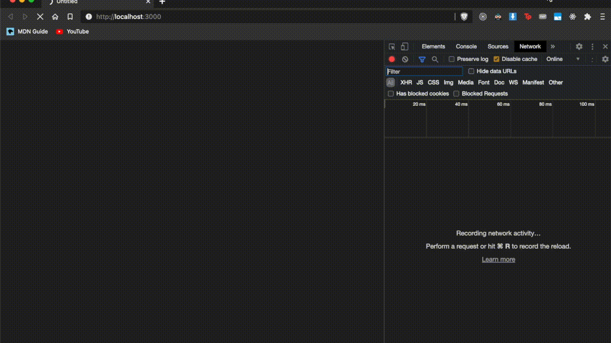

### File Compression
File compression amount can be controlled using the "quality" attribute (range from 10 to 100). Each image can have its own unique quality specification. The default quality passed in absence of `quality` parameter is 80. We recommend keeping the quality greater than or equal to 80 to prevent perceivable image quality degradation. 

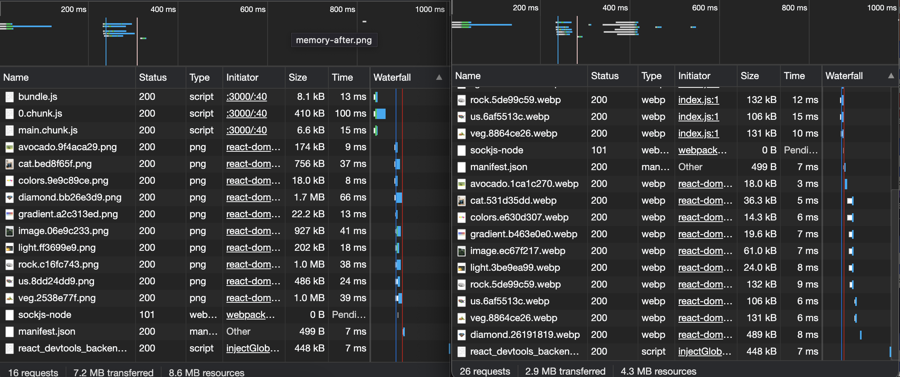

## Other Features
There are several benefits of using BetterImage:
1) Fallback image
2) Dynamic image import references 
3) Declarative styling

### Fallback Image
BetterImage renders come with fallback webp placeholders. The fallback image takes in the same attributes as the correctly rendered image. 

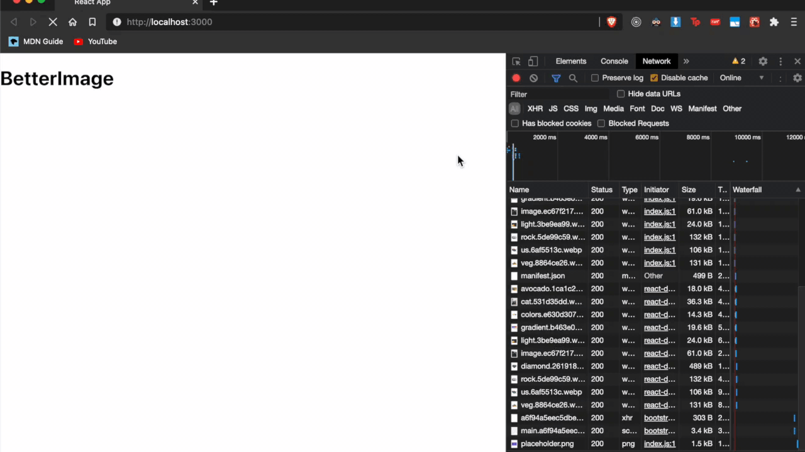

### Dynamic Image References
BetterImage can reference compressed webp image paths without manually specifying paths with `import from`. This effectively automates and abstracts away the manual process of converting image and re-importing them on the application using new image name/paths. BetterImage syntax is shown below all attributes are passed as string):

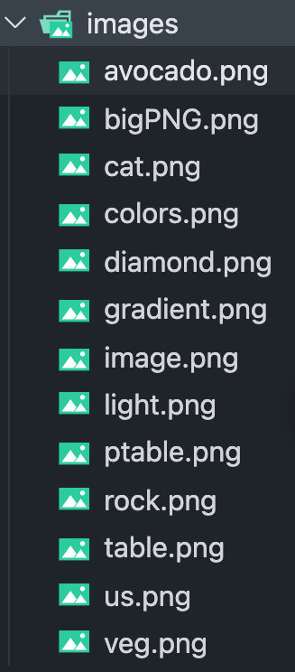
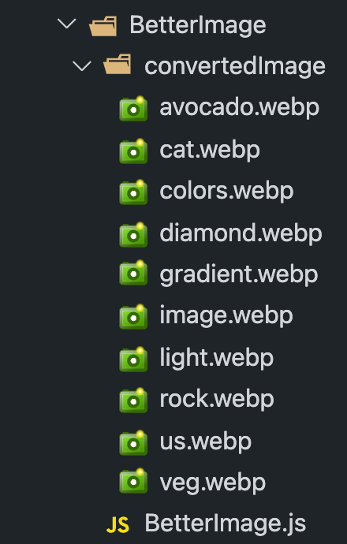

### Declarative Styling
Declarative styling significantly reduces frequent syntax errors that come with in-line styling in React. Common syntactical errors include: wrong unit, missing unit, missing parenthesis or brackets, missing space (when chaining), misplaced effects (filter vs transformation) and etc. BetterImage provides declarative styling to help developers avoid these common pitfalls.

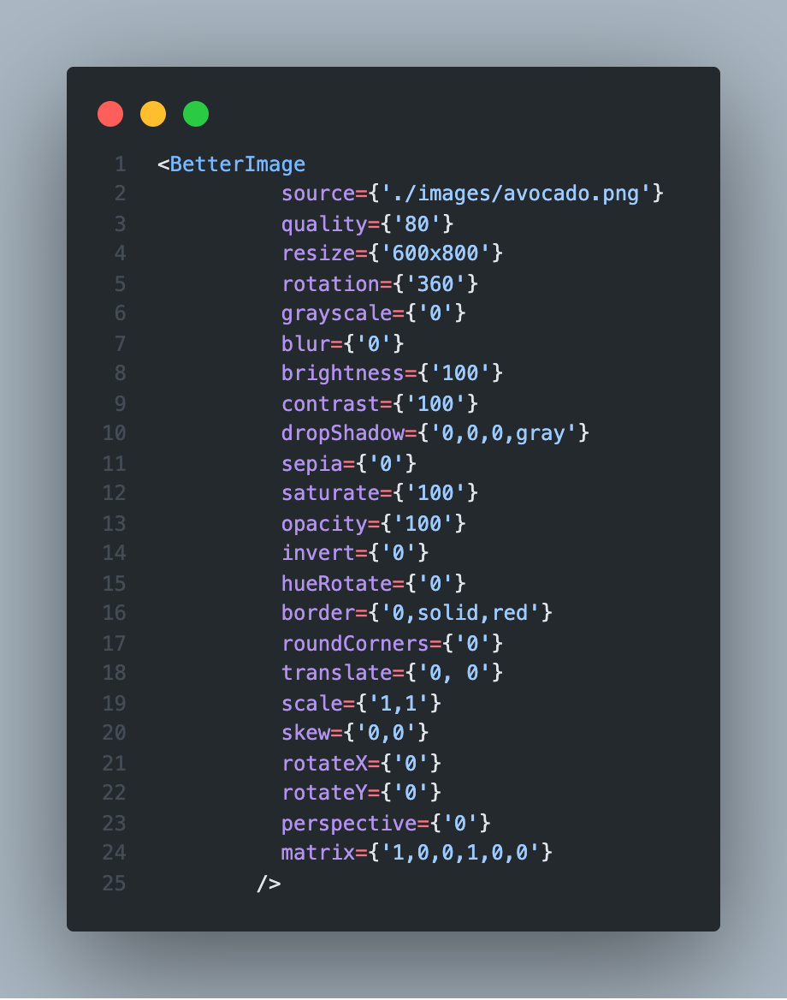

Here is the full list of vanity features available on BetterImage and their base units:
* resize: px, px (separated by x)
* quality: int
* rotation: degree
* blur: px
* grayscale: %
* brightness: %
* contrast: %
* sepia: %
* invert: %
* saturate: %
* opacity: %
* hueRotate: degree
* dropShadow: px, px, px, color
* roundCorners: px
* border: px, line-style, color
* matrix: int, int, int, int, int, int
* translate: px, %
* scale: int, int
* skew: degree
* perspective: px
* rotateX: degree
* rotateY: degree

## Benefits and Results

### Faster Image Renders
In a controlled experiment with 12 PNG images with various sizes, BetterImage improved Google Lighthouse Performance score of the test React application by 10 points (63 vs 53). This translates to 18.8% improvement in overall performance vs plain image render. Considering render time increase from file conversions, we believe this benefit would be significant to any image-heavy client side React applications.

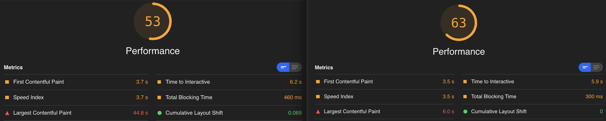

### Consistent and Scalable Image Styling
Rendering images on React may require each image component to have common and unique attributes per image. This can be worked around using class/id with CSS files or libraries but setting up external CSS file or frameworks/libraries during development is a redundant pain point. Developing and testing these edits in BetterImage is easier. Using the attributes provided, users can make in-line edits to the images and seamlessly chain them together to achieve both common and unique edits per images. 
<br> <br>
Using the example of unstyled page below:
<br>
 
<br> <br>
Using BetterImage applies consistent and unique image styling attributes directly from the component:
<br>
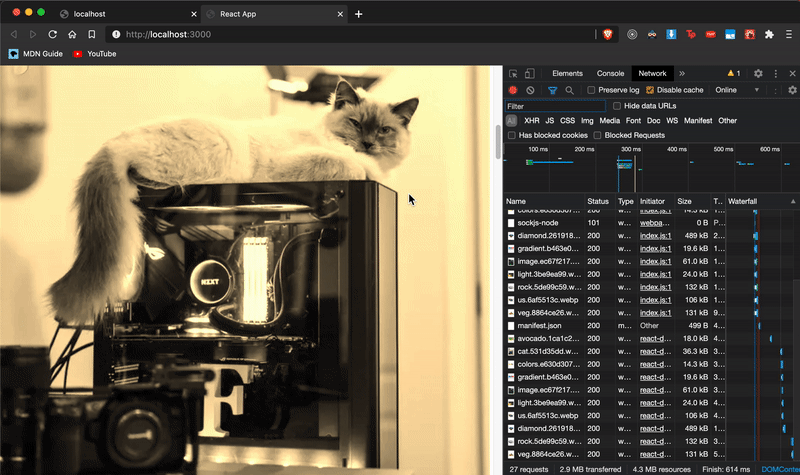

## Advanced Guides

### Default Values of Optional Attributes
When BetterImage component doesn't receive optional attributes, BetterImage detects the missing attributes and assigns default values to them. For example, when to constant parameters specified in the code.
<br>
List of default values passed can be found here:<br>

* resize: none (when no value is passed to resize, image will default to original size)
* quality: 80
* rotation: 0
* blur: 0
* grayscale: 0
* brightness: 100
* contrast: 100
* sepia: 0
* invert: 0
* saturate: 100
* opacity: 100
* hueRotate: 0
* dropShadow: 0, 0, 0, black
* roundCorners: 
* border: 0, solid, black
* matrix: 1, 0, 0, 1, 0, 0
* translate: 0px, 0%
* scale: 1, 1
* skew: 0, 0
* perspective: 0
* rotateX: 0
* rotateY: 0

### Why do you need to modify the WebPack configuration? 
BetterImage is built with the latest version of CRA. Because of this, the default webpack configuration doesn't support ES6 syntax `importAll` to  dynamically reference the converted images. For BetterImage to dynamically reference the image file, WebPack must be modified to make the component run as expected. The `file-loader` option is responsible for determining how the assets are 
